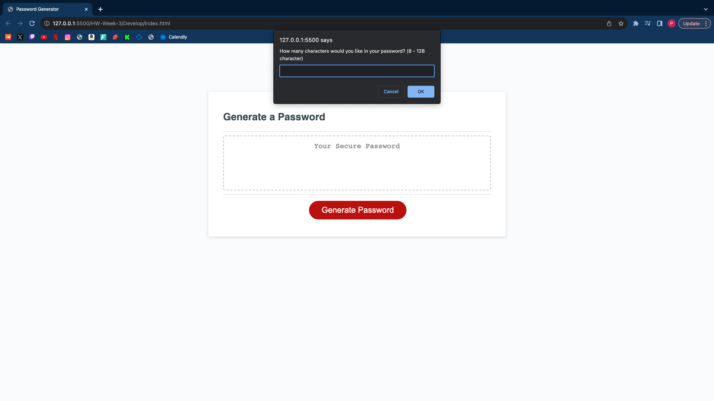
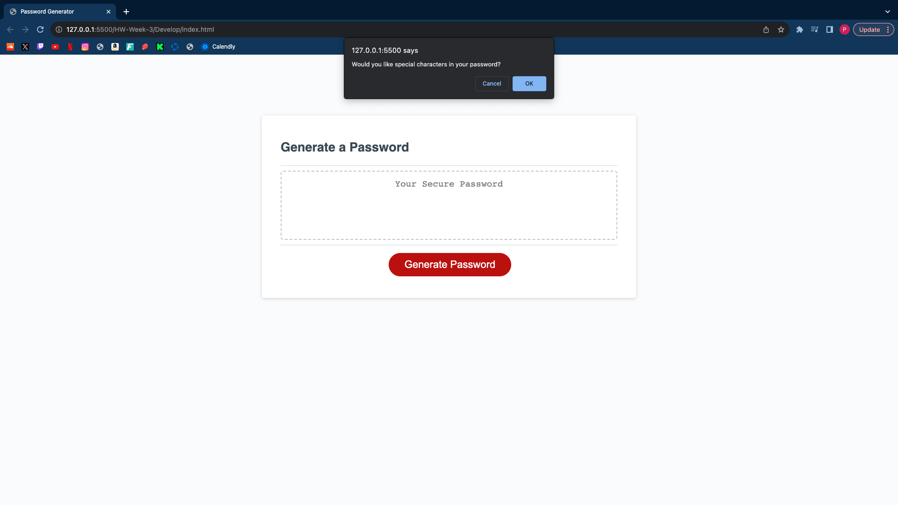
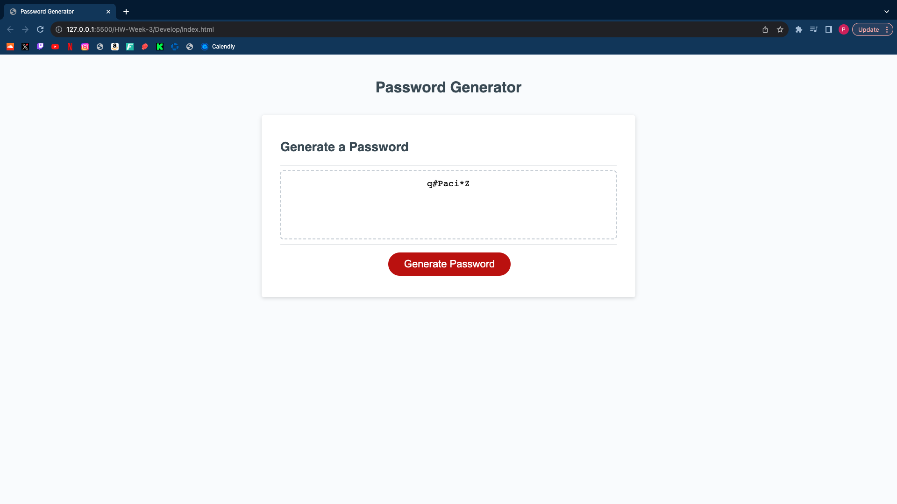

# HW-Week-3

##Description 

My motivation to do this javascript homework was to successfully create a password generator that gives different options for the user, my motivation was to finish this homework assignment for my bootcamp. I was also motivated by the fact that by creating this password generator I was going to be able to learn more about javascript. I built this project to build a password generator that can be successfully used by any user. The problem that this project solves the need to manually brainstorm possible passwords for oneself, instead one can use the password generator that I have created to help them find a password that meets their criterias. I learned many different things by building this project, I've learned where and how to use Math.floor and Math.random, I have also learned how to create usable if statements in a function. 

##Installation

1. Create the different arrays by using var 
2. Create the funtion getPrompts to meet all the requirements for the arrays by putting all the if statements and then adding return so that if all the statements are true then a password will be generated.
3. Put the loop in the function generatePasssword for the characterLength prompt
4. Put the Math.floor and Math.random in the generatePassword function so that it applys to the charaacterLength array. 
5. Insert the if and else statement in the funtion writePassword so if the user applys the correct values in the prompts then a password would be generated for the user. 
6. Final step was to add the event listener to create the functionality of everything that was written in the javascript.

##Usage

1. The user will first click the "Generate Password" button 

2. Then the user will be asked to type the number of how many characters they would like in their password, then click "Ok" or click "cancel" for no and cancel the whole process. The number that needs to be typed in needs to be  8 through 128 

3. Then the user will be asked if they want lowercase letters in their password, they would either click "ok" for yes or "Cancel" for no 

4. Then the user will be asked if they want uppercase letters in their password, they would either click "ok" for yes or "Cancel" for no 

5. Then the user will be asked if they want special characters in their password, they would either click "ok" for yes or "Cancel" for no 

6. Then the user will be asked if they want numbers in their password, they would either click "ok" for yes or "Cancel" for no 

7. After all these options have been chosen then a passwrod will be generated

##Credits 
 
Made by Piero Rodriguez (Github account = https://github.com/Piero9992023) 

Helped by https://developer.mozilla.org/en-US/ 

